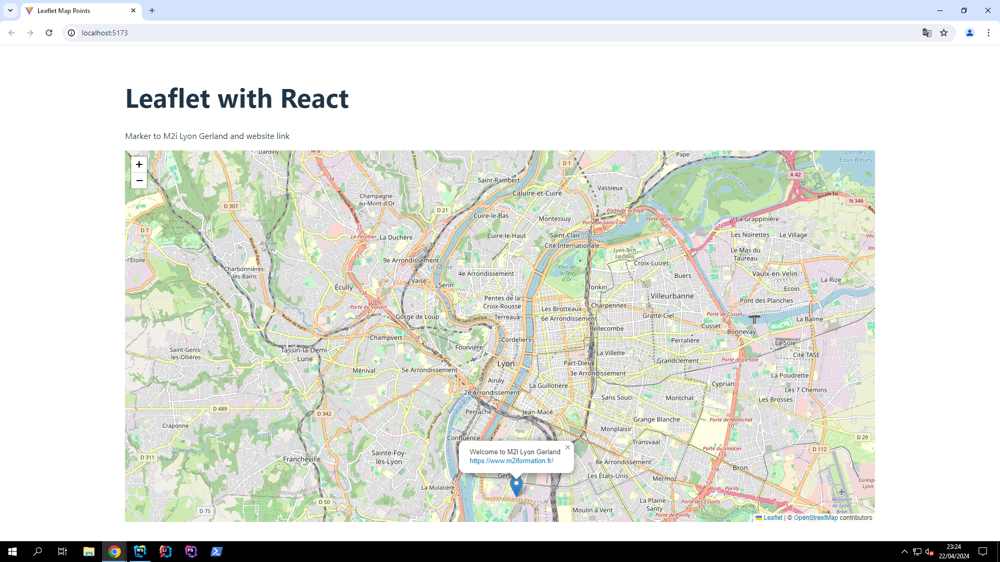

# Projet React avec Leaflet

Ce projet est une application React rapide intégrant la bibliothèque Leaflet pour afficher une carte pointant vers l'entreprise M2i Gerland, située dans le 7ème arrondissement de Lyon.

## Installation

Pour installer et exécuter ce projet localement, assurez-vous d'avoir Node.js et npm installés sur votre système. Ensuite, suivez ces étapes :

1. Clonez ce référentiel sur votre machine.
2. Naviguez vers le répertoire du projet dans votre terminal.
3. Exécutez la commande suivante pour installer les dépendances :

```bash
npm install
```

## Utilisation 

Une fois les dépendances installées, vous pouvez démarrer l'application en exécutant la commande suivante :

```bash
npm run dev
```

Cela démarrera le serveur de développement. 
Pour acceder au projet, rendez vous à l'adresse : [http://localhost:5173/](http://localhost:5173/)

## Fonctionnalités
- Affiche une carte pointant vers l'entreprise M2i Gerland à Lyon.
- Utilise un marqueur pour indiquer l'emplacement de l'entreprise.
- Le marqueur dispose d'un lien permettant d'ouvrir une nouvelle fenêtre du navigateur pour visiter le site Web de l'entreprise.

## Technologies utilisées   
### Vite + React
### Leaflet   

## Capture d'écran


## Contributions
Les contributions sont les bienvenues ! 

Si vous souhaitez contribuer à ce projet, veuillez me contacter.
## Auteur
[Marchand Loïc](mailto:nilpa018@yahoo.fr)
